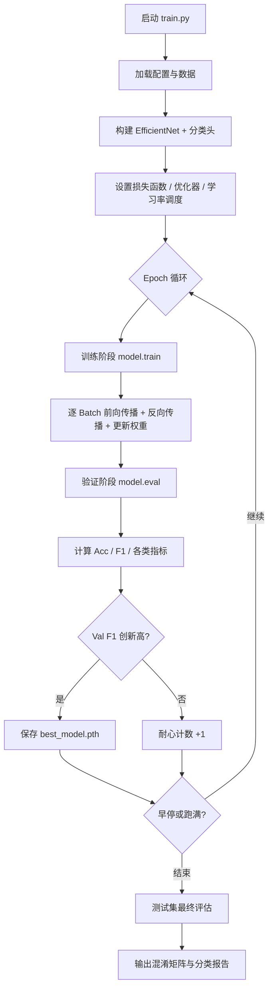

# 训练过程详解：模型是如何逐步提升的

本文档介绍 `python train.py` 运行时，模型从随机初始化（实际为预训练权重）到最终收敛的完整过程，以及 Loss、Accuracy、F1 等指标是如何一步步变好的。

---

## 一、整体流程概览

一次训练分为四个大阶段：

```
[1/4] 加载数据集
  ↓
[2/4] 构建模型（ImageNet 预训练 + 4 类分类头）
  ↓
[3/4] 循环训练（Epoch 1 → 2 → ... → 50 或早停）
  │     每个 Epoch：训练 → 验证 → 保存最佳模型
  ↓
[4/4] 加载最佳模型，在测试集上最终评估
```

每个 **Epoch** 代表模型**完整看过一遍训练集**。随着 Epoch 增加，模型对天气图像的特征理解逐渐加深，指标通常会先快速上升，再缓慢趋于平稳。



---

## 二、训练开始前：模型已经具备"基础视力"

### 2.1 预训练权重

项目使用 `timm` 加载 **ImageNet 预训练**的 EfficientNet-B0：

```yaml
model:
  backbone: "efficientnet_b0"
  pretrained: true
```

这意味着训练开始时，模型已经学会了：
- 识别边缘、纹理、颜色块
- 理解物体轮廓和场景结构

它**不是从零开始**，只需把"认识猫狗汽车"的能力，迁移到"认识 cloudy / rainy / snowy / sunny"。因此第 1 个 Epoch 的准确率通常就不会是随机猜的 25%，而可能直接到 60%~80%。

### 2.2 分类头替换

预训练模型原本输出 1000 类（ImageNet），项目将其替换为 **4 类天气分类头**。分类头权重是随机初始化的，所以早期模型对 4 类天气的区分能力较弱，需要靠训练逐步学好。

### 2.3 数据划分

当前 `val/` 和 `test/` 为空时，自动从 `train/` 按 **7:1.5:1.5** 划分：

| 集合 | 比例 | 作用 |
|------|------|------|
| 训练集 | 70% | 用于更新模型权重 |
| 验证集 | 15% | 用于选最佳模型、早停 |
| 测试集 | 15% | 训练结束后最终评估 |

验证集和测试集**不参与权重更新**，只用来衡量模型泛化能力。

---

## 三、单个 Batch：模型学习的最小步骤

每个 Epoch 内，训练集会按 `batch_size`（GPU 默认 32）切成多个 Batch。以约 13,000 张训练图、batch_size=32 为例，每个 Epoch 约有 **410 个 Batch**。

每个 Batch 的执行流程：

```
1. 读取一批图像 + 标签
       ↓
2. 数据增强（仅训练时：翻转、旋转、颜色抖动等）
       ↓
3. 前向传播：图像 → 模型 → 4 类 logits
       ↓
4. 计算损失 Loss（CrossEntropyLoss + 类别加权 + 标签平滑）
       ↓
5. 反向传播：计算每个参数的梯度
       ↓
6. 梯度裁剪（防止梯度爆炸，max_norm=1.0）
       ↓
7. 优化器更新权重（AdamW）
       ↓
8. 学习率调度器 step（每个 Epoch 结束后统一调整）
```

### 3.1 前向传播

模型对每张图输出 4 个数值（logits），经 Softmax 后变为概率：

```
输入图像 (3, 224, 224)
    ↓
EfficientNet-B0 主干（提取特征）
    ↓
分类头（映射到 4 类）
    ↓
输出: [0.12, 0.05, 0.78, 0.05]  →  预测 snowy（概率 0.78）
```

### 3.2 损失函数：模型优化的"指南针"

```python
CrossEntropyLoss(weight=类别权重, label_smoothing=0.1)
```

**Loss 越小 → 预测越接近真实标签。**

训练的目标就是**不断减小 Loss**，从而让 Accuracy 和 F1 上升。

三个关键组件：

| 组件 | 配置 | 作用 |
|------|------|------|
| 交叉熵 | 默认 | 预测错时产生较大惩罚 |
| 类别加权 | `use_class_weights: true` | 少数类 `cloudy` 权重更高（约 1.36），错判代价更大 |
| 标签平滑 | `label_smoothing: 0.1` | 防止模型过度自信，缓解过拟合 |

### 3.3 反向传播与权重更新

```
Loss 反向传播 → 计算梯度 → AdamW 更新参数
```

**AdamW 优化器**根据梯度方向和历史动量，小步调整数百万个参数，使下一次同类样本的 Loss 更小。

进度条上实时显示的三个值含义：

```
Epoch 1 [Train]: 45%|████ | 185/410 [loss: 0.52, acc: 0.78, lr: 0.000100]
```

- **loss**：当前已处理样本的平均损失，总体趋势应下降
- **acc**：当前已处理样本的累计准确率，总体趋势应上升
- **lr**：当前学习率，随训练缓慢下降

---

## 四、单个 Epoch：一次完整的学习周期

每个 Epoch 包含**训练**和**验证**两个阶段：

### 4.1 训练阶段（`model.train()`）

- 启用 Dropout（`drop_rate: 0.3`）和 BatchNorm 训练模式
- 对图像做随机数据增强，同一张图每个 Epoch 看到的版本不同
- 模型权重**会被更新**

数据增强帮助模型见到更多变化，提升泛化能力：

| 增强方式 | 配置 | 效果 |
|----------|------|------|
| 随机水平翻转 | 50% 概率 | 左右对称的天气场景 |
| 随机旋转 | ±15° | 不同拍摄角度 |
| ColorJitter | 亮度/对比度/饱和度 | 不同光照条件 |
| AutoAugment | ImageNet 策略 | 自动组合多种变换 |
| Random Erasing | 25% 概率 | 随机遮挡，模拟局部不可见 |

### 4.2 验证阶段（`model.eval()`）

- 关闭 Dropout，BatchNorm 使用统计均值
- **不做数据增强**，只做 Resize + 归一化
- 模型权重**不会被更新**

验证集的作用是回答一个问题：**模型在没见过的数据上表现如何？**

### 4.3 Epoch 结束后的输出

```
Epoch 12/50
  Train - Loss: 0.2341, Acc: 0.9123, F1: 0.9087
  Val   - Loss: 0.3012, Acc: 0.8945, F1: 0.8901
  [Train] 各类指标:
    类别          Precision     Recall         F1
    cloudy         0.8956     0.8723     0.8838
    rainy          0.9234     0.9312     0.9273
    snowy          0.9189     0.9201     0.9195
    sunny          0.9102     0.9156     0.9129
    macro avg      0.9120     0.9098     0.9109
  [Val] 各类指标:
    ...
  [OK] 保存最佳模型 (Val F1: 0.8901)
```

**如何解读：**

| 现象 | 含义 |
|------|------|
| Train Loss 下降、Acc 上升 | 模型在学习训练集规律 |
| Val F1 上升 | 泛化能力在提升 |
| Train 指标 > Val 指标 | 正常差距，轻微过拟合 |
| Train 很高、Val 停滞或下降 | 过拟合，需要早停或加强正则 |
| 某类 F1 明显偏低 | 该类别是短板，如 `cloudy` |

---

## 五、指标是如何"慢慢提升"的

### 5.1 典型的训练曲线形态

```
指标
 ↑
 │         ╭──────────── Val F1（先升后平）
 │       ╭─╯
 │     ╭─╯
 │   ╭─╯
 │ ╭─╯
 │╭╯
 └────────────────────────→ Epoch
 1    5    10   15   20   30   50
```

**阶段一（Epoch 1~5）：快速提升**
- 预训练特征迅速适配天气分类
- Loss 从 ~1.0 快速降到 ~0.3
- F1 可能从 0.6 跳到 0.85+
- 分类头权重变化最大

**阶段二（Epoch 5~20）：稳步提升**
- 主干网络微调，学习天气特有特征（云层、雨滴、雪地反光等）
- 各类 F1 逐步均衡
- 学习率按余弦曲线缓慢下降，步子变小，精调参数

**阶段三（Epoch 20+）：趋于收敛**
- 指标提升变慢，在高位小幅波动
- 若 Val F1 连续 10 个 Epoch 不提升，触发**早停**
- 保存的是历史最佳模型，而非最后一个 Epoch

### 5.2 Loss 与 F1 的关系

```
Loss 下降  →  预测概率更接近真实标签  →  更多样本预测正确
                                         →  Precision / Recall 上升
                                         →  F1 上升
```

F1 是 Precision 和 Recall 的调和平均。模型提升时，通常两者都会改善：
- **Recall 上升**：以前漏掉的 `cloudy` 现在能认出来了
- **Precision 上升**：以前误判为 `rainy` 的 `sunny` 现在分对了

### 5.3 最佳模型的选择

项目按 **验证集 F1（f1_macro）** 选最佳模型，而非最后一个 Epoch：

```yaml
best_metric: "f1_macro"
```

```
Epoch 8:  Val F1 = 0.872  → 保存 ✓
Epoch 9:  Val F1 = 0.885  → 保存 ✓（覆盖）
Epoch 10: Val F1 = 0.881  → 不保存，耐心 1/10
...
Epoch 19: Val F1 = 0.885  → 仍不保存，耐心 10/10 → 早停
最终使用 Epoch 9 的模型（F1 = 0.885）
```

这保证了用的是**泛化最好**的模型，而不是过拟合最严重的模型。

---

## 六、推动提升的六大机制

### 6.1 迁移学习（预训练）

| 阶段 | 模型状态 |
|------|----------|
| 训练前 | 主干已懂通用视觉特征，分类头随机 |
| 早期 | 分类头快速学会粗分类 |
| 中后期 | 主干微调，学习天气特有模式 |

### 6.2 类别加权损失

`cloudy` 样本最少（约 19%），自动获得更高损失权重（约 1.36）。模型会更努力学好少数类，从而提升宏平均 F1。

### 6.3 学习率余弦退火

```yaml
scheduler: "cosine"
learning_rate: 0.0001
```

学习率变化示意：

```
LR
0.0001 │╲
       │ ╲
       │  ╲___
0.000001│      ╲___
       └──────────────→ Epoch
       早期大步探索    后期小步精调
```

- **早期**：较大学习率，快速找到大致方向
- **后期**：极小学习率，精细调整，避免跳过最优点

### 6.4 正则化防过拟合

| 手段 | 配置 | 作用 |
|------|------|------|
| Dropout | 0.3 | 随机丢弃神经元，防止死记硬背 |
| 权重衰减 | 0.0001 | 限制参数过大 |
| 标签平滑 | 0.1 | 防止过度自信 |
| 数据增强 | 多项 | 等价于扩充训练集 |
| 早停 | patience=10 | Val F1 不提升则停止 |

### 6.5 混合精度训练（GPU）

GPU 上使用 FP16 混合精度（AMP），加速训练同时节省显存，使更大 batch_size 成为可能，训练更稳定。

### 6.6 梯度裁剪

```yaml
gradient_clip: 1.0
```

将梯度范数限制在 1.0 以内，防止个别 Batch 产生过大梯度导致训练崩溃，保证提升过程平稳。

---

## 七、训练过程中你能看到什么

### 7.1 终端实时输出

**Batch 级（进度条）：**
```
Epoch 3 [Train]: 72%|███████▏  | 295/410 [loss: 0.38, acc: 0.86, lr: 0.000095]
Epoch 3 [Val]:   100%|██████████| 88/88 [loss: 0.42, acc: 0.84]
```

**Epoch 级（汇总 + 各类 F1）：**
```
Epoch 3/50
  Train - Loss: 0.3812, Acc: 0.8623, F1: 0.8556
  Val   - Loss: 0.4156, Acc: 0.8412, F1: 0.8345
  [Train] 各类指标: ...
  [Val] 各类指标: ...
  [OK] 保存最佳模型 (Val F1: 0.8345)
```

### 7.2 TensorBoard 可视化

```bash
tensorboard --logdir=results/logs
```

可观察的曲线：

| 曲线 | 说明 |
|------|------|
| `Train/Loss` | 训练损失，应整体下降 |
| `Train/Accuracy` | 训练准确率，应整体上升 |
| `Train/LR` | 学习率变化 |
| `Val/F1_Macro` | 验证集宏 F1，选模型的依据 |
| `Val/F1/cloudy` 等 | 各类 F1 变化，定位短板 |
| `Val/Loss` | 验证损失，应与 Train Loss 同步下降 |

### 7.3 正常 vs 异常

| 正常 | 异常（需关注） |
|------|----------------|
| Train/Val Loss 都在下降 | Loss 变成 NaN → 学习率过大 |
| Val F1 整体上升 | Val F1 持续下降 → 过拟合严重 |
| 各类 F1 逐步均衡 | 某类 F1 长期 < 0.5 → 数据或标注问题 |
| Train F1 略高于 Val F1 | Train F1 远高于 Val F1（差 > 0.15）→ 过拟合 |

---

## 八、训练结束：最终检验

训练循环结束后（跑满 50 Epoch 或早停），流程进入 `[4/4]`：

```
1. 加载 best_model.pth（验证集 F1 最高的那次）
2. 在测试集上评估（测试集从未参与训练和选模型）
3. 输出总体指标 + 各类 F1 + Classification Report
4. 保存 confusion_matrix.png
```

测试集结果是**无偏的最终成绩**，比训练过程中的 Val 指标更有参考价值。

---

## 九、一次完整训练的时间线示例

以下为一个典型的训练过程（数值为示意）：

| Epoch | Train Loss | Val F1 | 事件 |
|-------|-----------|--------|------|
| 1 | 0.85 | 0.62 | 预训练特征快速适配，保存最佳 |
| 3 | 0.45 | 0.81 | F1 大幅提升，保存最佳 |
| 8 | 0.28 | 0.89 | 进入高位平台，保存最佳 |
| 12 | 0.22 | 0.90 | 新高，保存最佳 |
| 15 | 0.18 | 0.89 | 未提升，耐心 1/10 |
| 18 | 0.15 | 0.88 | Val F1 开始下降，过拟合信号 |
| 22 | 0.12 | 0.87 | 耐心 10/10，**早停触发** |
| 结束 | — | — | 使用 Epoch 12 的模型（F1=0.90）做测试 |

```
测试集结果:
  Accuracy:  0.8956
  F1-Score:  0.8912
  [Test] 各类指标:
    cloudy: F1=0.8523  ← 少数类，通常最低
    rainy:  F1=0.9123
    snowy:  F1=0.9089
    sunny:  F1=0.9012
```

---

## 十、相关配置速查

影响训练提升速度和质量的关键参数：

```yaml
# configs/config.yaml

training:
  epochs: 50                      # 最大训练轮数
  learning_rate: 0.0001           # 初始学习率
  scheduler: "cosine"             # 学习率衰减策略
  early_stopping_patience: 10     # 早停耐心
  use_class_weights: true         # 类别加权
  best_metric: "f1_macro"         # 最佳模型选型指标
  label_smoothing: 0.1            # 标签平滑
  gradient_clip: 1.0              # 梯度裁剪

model:
  backbone: "efficientnet_b0"     # 模型容量
  pretrained: true                # 预训练开关
  drop_rate: 0.3                  # Dropout

augmentation:
  use_auto_augment: true          # 自动增强
  random_erase: 0.25              # 随机擦除
```

---

## 十一、相关文档

- [README.md](README.md) — 项目概览与快速开始
- [TUTORIAL.md](TUTORIAL.md) — 手把手操作教程
- [TRAINING_OUTPUT.md](TRAINING_OUTPUT.md) — 训练产物说明
- [configs/config.yaml](configs/config.yaml) — 完整训练配置
